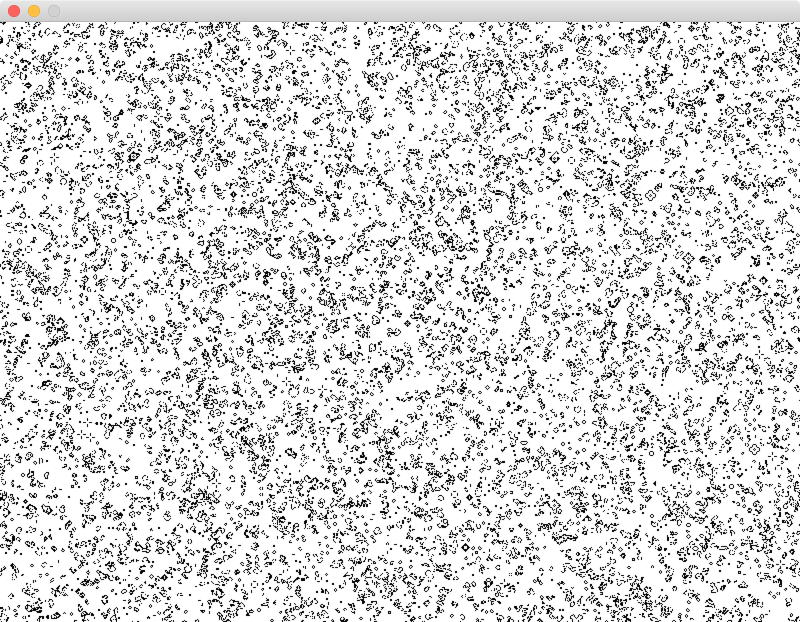

# Game of live using SDL

This is a very old project I did in highschool (this explains the poor C code ;). It then ran on linux where it was very easy to compile (something along `gcc gol.c -lSDL`). When I found it on my hard drive, I wanted to revive it. This was not that easy on OS X, but in the end I found the correct compile options.

## Compilation

    brew install sdl sdl_image
    make
    # run
    ./gol

